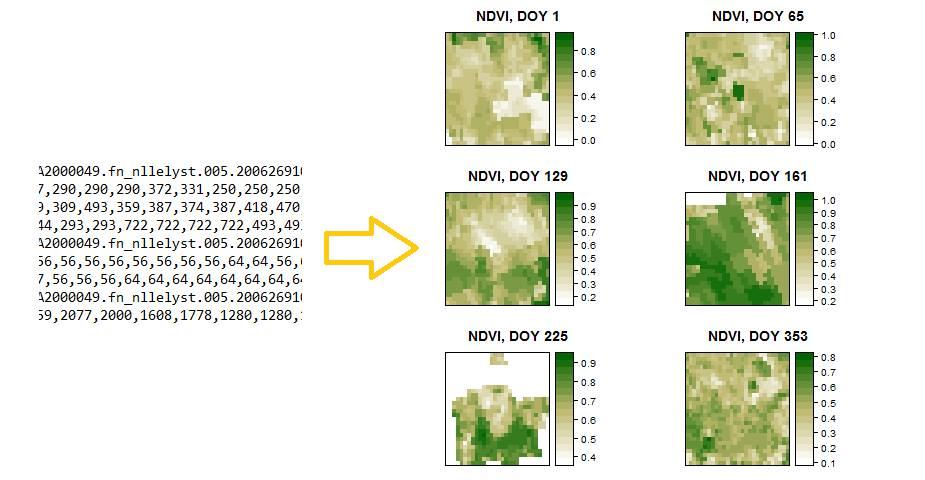

## Introduction
Phenology: 
*the study of the timing of recurring biological cycles and their connection to climate providing society with an independent measure on how ecosystems are responding to climate change (White, M., et al. 2009)*

- Forestry: to monitor carbon levels at atmosphere

- Natural resources management (water and timber)

- Agriculture: planting and harvesting time, pest control

- Understanding hazard: monitoring and prediction of drought and fire risk

## Introduction

<span style="color: green;"><b> Greenup date </b></span>

*when green leaves are first detected in spring* 

Factors influencing plant phenology:

- precipitation
- temperature
<br />
<br />
<center>

</center>

## Study area
***Lelystad, the Netherlands***
<br />
- Broadleaves forest <br />
- sufficiently large area for MODIS satellite imagery <br />
- continuous data availability <br />
<center>

</center>

## Material and methods
**Libraries:**
<br />
- spatial data:  **sp, raster, rgdal**
<br />
- visualization: **ggplot2, googleVis, gridExtra**
<br />
- phenology:     **phenex**
<br />
- ?????????:     **phenoMODIS**
<br />
<br />
<center>

<center>

## Material and methods

- Flowchart

<center>

<center>

## Download data

- MODIS subset
<br />

<span style="color: #cc0000;"><span style="background-color: #eeeeee;"><span style="color: black;">ndvi_clear13 &lt;- <strong><span style="color: #e06666;">modisSubset</span></strong>("Lelystad", "NDVI", 2013, rel = TRUE) </span></span></span>
<br />
<center>

</center>

<br />
- Meteorogical data
<br />

<span style="color: #cc0000;"><span style="background-color: #eeeeee;"><span style="color: black;">meteo &lt;- <span style="color: #e06666;"><strong>getKNMIdata</strong></span>(269)</span></span></span>

## Preprocessing

<br />
Comparison of cummulative values
<br />

<center>

<center>

<br />
<br />

<span style="color: green;"><b> Are the greenup date affected by the differences in weather between 2013 and 2014? </b></span>

## Preprocessing

<br />
From .txt to Raster!

<br />
stack_2013 &lt;- <strong><span style="color: #e06666;">modisRaster</span></strong>(ndvi_clear13,"Lelystad")
<br />

<center>

<center>

## Extract Phenology


<br />

<span style="color: #cc0000;"><span style="background-color: #eeeeee;"><span style="color: black;">greenup2013 &lt;-<span style="color: #e06666;"> <strong><span style="color: #e06666;">getPhenology</span></strong></span>(df2013, DOY2013, "SavGol", 2013)</span> </span></span>

<br />

<center>

<center>

<br />

<center>

<strong>phenex:</strong> <a href="http://cran.r-project.org/web/packages/phenex/">http://cran.r-project.org/web/packages/phenex/</a>
<center>


## Results

```{r, echo=FALSE, results='hide', message=FALSE}
require(gridExtra) # also loads grid
require(lattice)
#install.packages("spocc")
library(googleVis)

# load required packages and functions
library(phenex)
library(sp)
library(raster)
library(rgdal)
library(ggplot2)
library(googleVis)


source('R/modisSubset.R')
source('R/getDate.R')
source('R/modisRaster.R')
source('R/df2raster.R')
source('R/DOYstack.R')
source('R/getROI.R')
source('R/getPhenology.R')
source('R/getKNMIdata.R')
source('R/interactiveMAP.R')

#-----------------------------------------------------------------------------------------
# 1) meteorogical KNMI data analysis
#-----------------------------------------------------------------------------------------

# download meteorological data of Leleystad station (ID = 269). source: http://www.knmi.nl/klimatologie/daggegevens/download.html
meteo <- getKNMIdata(269)

# subset daily mean temperature (TG) and daily precipitation (RH) data from the year of 2013 and 2014
met13 <- meteo[as.numeric(format(meteo$YYYYMMDD, "%Y")) == 2013, c("YYYYMMDD", "TG", "RH")]
met14 <- meteo[as.numeric(format(meteo$YYYYMMDD, "%Y")) == 2014, c("YYYYMMDD", "TG", "RH")]

# multiply the TG and RH with 0.1 (TG is in 0.1 deg Celcius, RH is in 0.1mm)
met13$TG <- met13$TG*0.1
met13$RH <- met13$RH*0.1
met14$TG <- met14$TG*0.1
met14$RH <- met14$RH*0.1

# evaluation of the difference in temperature and precipitation between 2013 and 2014
## apply cumulative summary for the table
head(met13) # inspect the data
meteo13 <- apply(met13[,2:3],2,cumsum) # TG and RH are in column 2 and 3 
meteo14 <- apply(met14[,2:3],2,cumsum)
meteo13 <- as.data.frame(meteo13) # coerce to data frame
meteo14 <- as.data.frame(meteo14)

# temperature (TG) as data frame
temp <- cbind(meteo13$TG, meteo14$TG)
temp <- as.data.frame(temp)
colnames(temp) <- c("TG2013", "TG2014") # give the proper name of column
temp$day <- seq.int(nrow(temp)) # add column: day-of-year

# precipitation (RH) as data frame
precip <- cbind(meteo13["RH"], meteo14["RH"])
precip <- as.data.frame(precip)
colnames(precip) <- c("RH2013", "RH2014") # give different name of column
precip$day <- seq.int(nrow(precip)) # add column: day-of-year

#----------------------------------------------------------------------------------------
# 2) MODIS remotely sensed data
#----------------------------------------------------------------------------------------

# download for Lelystad flux tower the NDVI band for 2013 and 2014 by using the  ModisSubset function. The reliability is selected as TRUE in order to perform a cloud  cleaning.
ndvi_clear13 <- modisSubset("Lelystad", "NDVI", 2013, rel = TRUE) 
ndvi_clear14 <- modisSubset("Lelystad", "NDVI", 2014, rel = TRUE) 

# create raster stacks from the subset MODIS data
stack_2013 <- modisRaster(ndvi_clear13,"Lelystad")
stack_2014 <- modisRaster(ndvi_clear14,"Lelystad")
stack_2013<-stack_2013/10000
stack_2014<-stack_2014/10000
# get observation dates for the selected subsets
DOY2013<- getDate("Lelystad", "NDVI", 2013)
DOY2014<- getDate("Lelystad", "NDVI", 2014)

# gives DOY as name in stack's layers
stack2013 <- DOYstack(stack_2013, DOY2013)
stack2014 <- DOYstack(stack_2014, DOY2014)

#----------------------------------------------------------------------------------------
# 3) specification of the area of interest
#----------------------------------------------------------------------------------------

# url <- "https://github.com/tziol001/Project-Geoscripting/blob/master/data/clc2012.zip"
# download.file(url=url, destfile='data/corine.zip', method='auto')
unzip('data/clc2012.zip')

# import the corine landcover 2012, in this project a preprocessing of corine data is performed in order to achieve faster computation time. For this reason only the corine for The Netherlands is selected
corine <- list.files ('clc2012/', pattern = glob2rx('*.shp'), full.names = TRUE)
layerName <- ogrListLayers(corine)
clc2012 <- readOGR(corine, layer = layerName)

# select the deciduous forest clc_code: 311
clc2012_forest <- clc2012[clc2012$CODE_12 == 311,]

# extract all the values from the layers of the rasterstack by using the selected forest area as a mask. These data.frames will be used as an input into the getPhenology function.   
df2013<- getROI(stack2013, clc2012_forest)
df2014<- getROI(stack2014, clc2012_forest)

#----------------------------------------------------------------------------------------
# 4) calculation of phenological metrics
#---------------------------------------------------------------------------------------- 

# prepare the data for pheno analysis and extract the greenup date for each pixel by using an assymetric Gaussian("Gauss") function from the phenex package. Method could be also specified as "SavGol". 
greenup2013<-getPhenology(df2013, DOY2013, "SavGol", 2013)
greenup2014<-getPhenology(df2014, DOY2014,"SavGol", 2014)

# calculate the differences in the greenup dates between the two years
diff <- greenup2014 - greenup2013
#----------------------------------------------------------------------------------------
# 5.1) simple statistical analysis
#----------------------------------------------------------------------------------------

# create a raster and a KML of the difference between the estimated greeup dates of 2013 and 2014 
greenup_diff <- modisRaster(diff,"Lelystad")

# boxplots and histogram statistic results
diff_table<-as.data.frame(t(diff))

# create a histogram in which is indicated the differences in the greeen up DOYS  
Hist <- gvisHistogram(diff_table, options=list(
  legend="{ position: 'top', maxLines: 1 }",
  colors="['#5C3292']",
  width=400, height=360))

inter.map.2013 <- modisRaster(greenup2013,"Lelystad")
map1 <- interactiveMAP(inter.map.2013)
```

## Histogram

```{r, echo=FALSE, results='asis'}
print(Hist)
```

<br />

<span style="color: green;"><b> Greenup date (leaf emergence) happens earlier in warmer and wet years!! </b></span>


## Interactive greenup date map of 2013

<br />
<br />
<center>

<center>

<br />
<span style="color: green;"><b> Future plans: Add the temporal NDVI profile in each pixel </b></span>


## Validation
<br />
<span style="color: #cc0000;"><span style="background-color: #eeeeee;"><span style="color: black;">greenup2013 &lt;-<span style="color: #e06666;"> <strong><span style="color: #e06666;">getPhenology</span></strong></span>(df2013, DOY2013, "SavGol", 2013)</span> </span></span>
<br />
<span style="color: #cc0000;"><span style="background-color: #eeeeee;"><span style="color: black;">greenup2013 &lt;-<span style="color: #e06666;"> <strong><span style="color: #e06666;">getPhenology</span></strong></span>(df2013, DOY2013, "Gauss", 2013)</span> </span></span>
<br />


<center>

<center>

## Creating R packages

library (phenoMODIS)

Contains 9 functions
<br />
<br />
<strong>Writing R extensions:</strong> <span class="_5yl5" data-reactid=".1h.$mid=11422553793663=214d9d539c177475108.2:0.0.0.0.0"><span data-reactid=".1h.$mid=11422553793663=214d9d539c177475108.2:0.0.0.0.0.0"><a data-reactid=".1h.$mid=11422553793663=214d9d539c177475108.2:0.0.0.0.0.0.$range0:0" href="http://cran.r-project.org/doc/manuals/R-exts.html" rel="nofollow" target="_blank">http://cran.r-project.org/doc/manuals/R-exts.html</a></span></span><br />
<span class="_5yl5" data-reactid=".1h.$mid=11422553793663=214d9d539c177475108.2:0.0.0.0.0"><span data-reactid=".1h.$mid=11422553793663=214d9d539c177475108.2:0.0.0.0.0.0"></span></span><div data-reactid=".1h.$mid=11422553861884=295d02bd3e8675ce421.2:0.0.0.0">
<span class="_5yl5" data-reactid=".1h.$mid=11422553793663=214d9d539c177475108.2:0.0.0.0.0"><span data-reactid=".1h.$mid=11422553793663=214d9d539c177475108.2:0.0.0.0.0.0"><span class="_5yl5" data-reactid=".1h.$mid=11422553861884=295d02bd3e8675ce421.2:0.0.0.0.0"><span data-reactid=".1h.$mid=11422553861884=295d02bd3e8675ce421.2:0.0.0.0.0.0"><strong>Package in 2 minutes: </strong><a data-reactid=".1h.$mid=11422553861884=295d02bd3e8675ce421.2:0.0.0.0.0.0.$range0:0" href="https://www.facebook.com/l.php?u=https%3A%2F%2Fwww.youtube.com%2Fwatch%3Fv%3DScV7XXlBZww&amp;h=xAQFA2-S3" rel="nofollow" target="_blank">https://www.youtube.com/watch?v=ScV7XXlBZww</a></span></span></span></span></div>
<span class="_5yl5" data-reactid=".1h.$mid=11422553793663=214d9d539c177475108.2:0.0.0.0.0"><span data-reactid=".1h.$mid=11422553793663=214d9d539c177475108.2:0.0.0.0.0.0">
</span></span><br />

## Conclusion
- from meteorogical data, we conclude that 2014 is warmer and more humid

- the year of 2014 has the earlier greenup date compare to 2013

- phenology studies could be as evidence and a predictor of a changing climate

- using images with spatial and temporal resolution will increase the accuracy (e.g. SENTINEL2)

<br />
<br />
<br />
<span style="color: blue;"><b> In addition: </b></span>

- numerous packages are already available, try to fit it in your case!!!

- use LINUX, to make your life easier!!

- WARNING!! Avoid R markdown presentation, it's complicated!!

##


<center>

</center>
